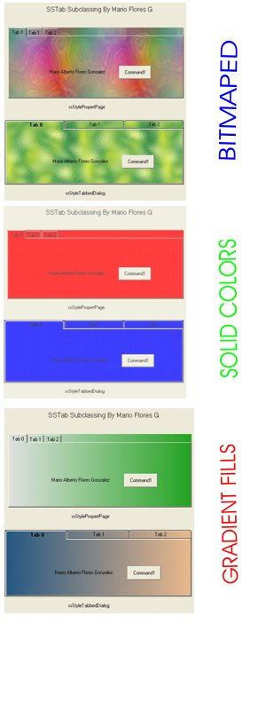



## Cool SSTab \+\+ \( Update 17/02/04 Animated Gradient Effect\)

### Description

Change the Old Appearance of the SSTab Control With Some new Cool Options...

Make it a different Color, or Give it a nice Gradient Effect, even Add a BackGround Image Style..

A simple but very effective code to subclass the SSTab Control.. TabStrip ..(Slider control and MonthView not Fully tested but works as well)
 
### More Info
 

             |
---                |---
**Submitted On**   |2004-02-17 13:31:18
**By**             |[MArio Flores G](https://github.com/Planet-Source-Code/PSCIndex/blob/master/ByAuthor/mario-flores-g.md)
**Level**          |Intermediate
**User Rating**    |4.9 (161 globes from 33 users)
**Compatibility**  |VB 6\.0
**Category**       |[Graphics](https://github.com/Planet-Source-Code/PSCIndex/blob/master/ByCategory/graphics__1-46.md)
**World**          |[Visual Basic](https://github.com/Planet-Source-Code/PSCIndex/blob/master/ByWorld/visual-basic.md)
**Archive File**   |[Cool\_SSTab1710032172004\.zip](https://github.com/Planet-Source-Code/mario-flores-g-cool-sstab-update-17-02-04-animated-gradient-effect__1-51649/archive/master.zip)

